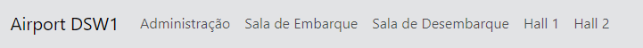
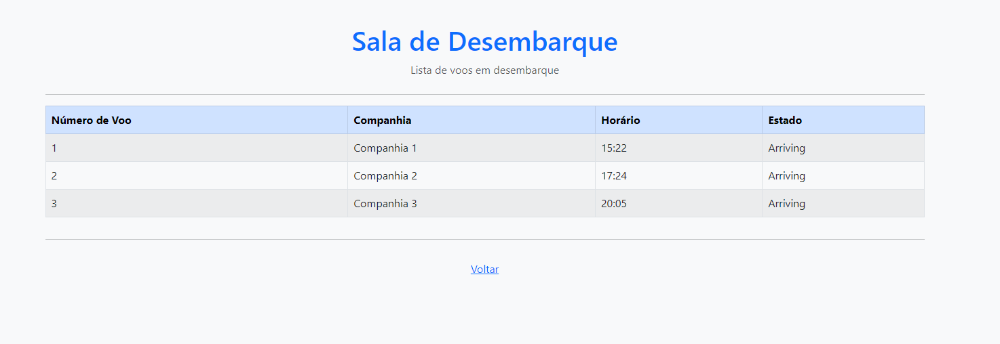
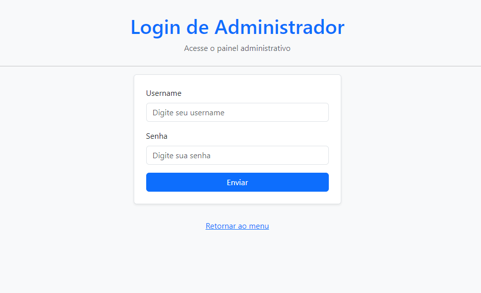
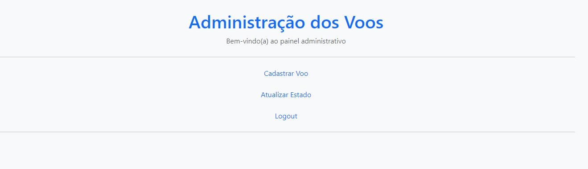
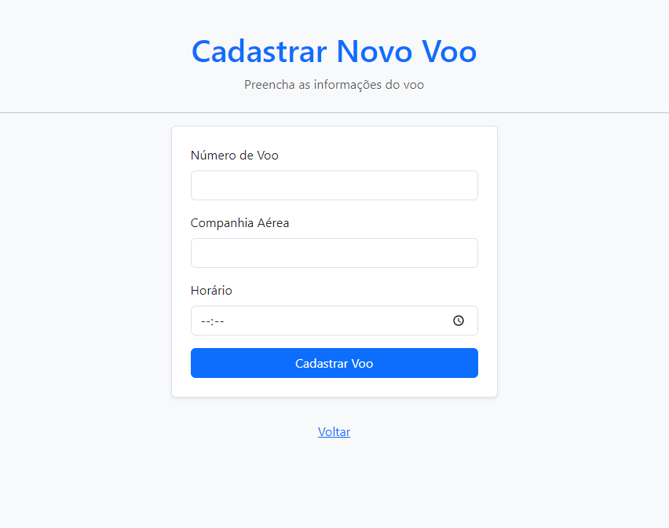
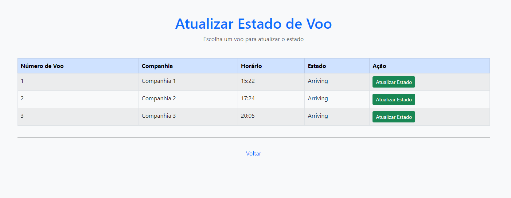

# Projeto: Gerenciador de voos

## Descrição

### Autor:

O projeto do **Gerenciador de voos** foi feito pelo aluno de análise e desenvolvimento de sistemas do IFSP Araquara Gabriel Ventura Pires

### Técnologias:

- **JSP:** Foi Utilizado para a criação de todas as páginas utilizadas.
- **Java:** Principal linguagem de programação utilizada, necessária para a criação de toda a lógica das funções do programa.
- **Bootstrap:** Utilizado para estilizar as página JSP.

### Descrição Geral:

Num geral o projeto é uma aplicação Web que simula um gerenciador de voos. O sistema possui várias funcionalidades como:

- **Login de administrador:** O sistema possui uma página de login onde apenas o usuário admin com a senha admin pode acessar.

- **Cadastro de voos:** Quando logado, o admin pode cadastrar os voos com seu número (deve ser único), sua companhia aérea e o horário de voo.

- **Atualizar estado de voo:** Cada voo começa começa no estado "chegando" e vai indo para chegando → embarcando → decolando → decolado, quando chegar em decolado ele é retirado da lista de voos. A funcionalidade de atualizar estado de voo é única do admin, ele terá uma tabela com os voos, e um botão para alterar estado.

- **Logout:** Quando o admin estiver logado ele pode fazer seu logout.

- **Páginas dos totens:** No menu principal teremos uma página para cada totem (estado dos voos), nessa páginas poderemos ter acesso a uma tabela de voos para cada estado.

## Prints do site:

### Página Inicial

Nessa página temos acesso a links para fazer o login de administrador, e acesso aos totens, com as tabelas de voos de cada estado de voo.

### Exemplo de totem

Este é um exemplo de uma página de totem (neste caso de voos no estado de desembarque/arriving), como podemos ver temos uma tabela com os voos cadastrados no estado do totem.

### Login administrador

Aqui temos nossa página de login do administrador, caso seja inserido o username admin e senha admin, o usuário sera levado a home do admin, senão uma mensagem de erro irá aparecer.

### Home admin

A home admin é a página onde serão mostradas as duas funcionalidades do admin, cadastrar voos e alterar seus estados, e a função de logout.

### Cadastro de voos

Na página de cadastro é onde o admin pode cadastrar noovos voos, tendo que inserir o número, a companhia e o horário de voo.

### Atualizar estado de voo

Por último temos a página de atualizarr estado de voo, onde o admin terá acesso a uma tabela com todos os voos, e poderá clicarr no botão de atualizar estado.

